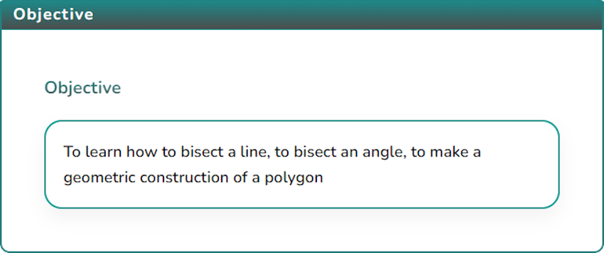
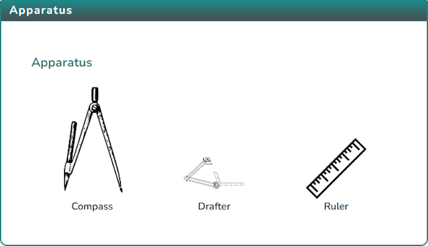
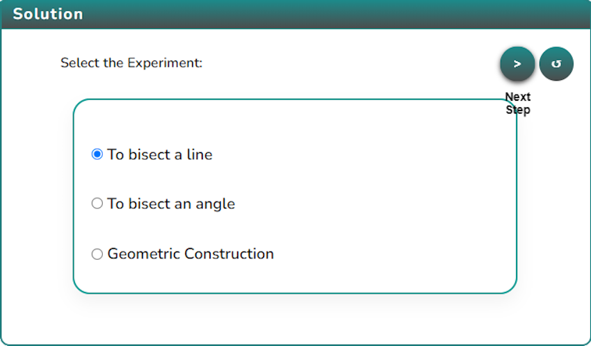
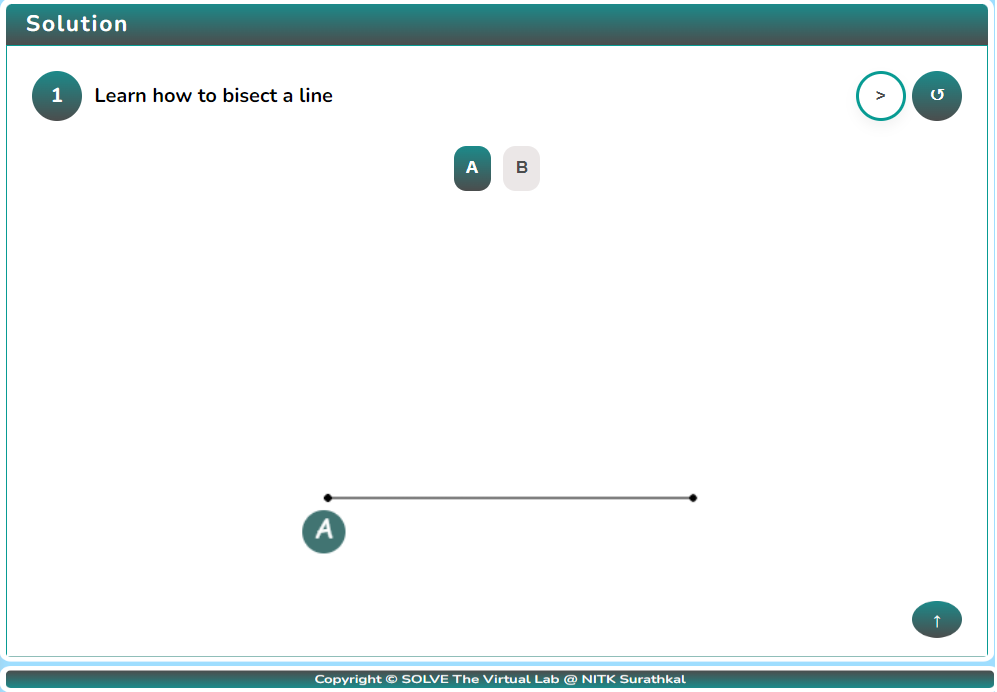
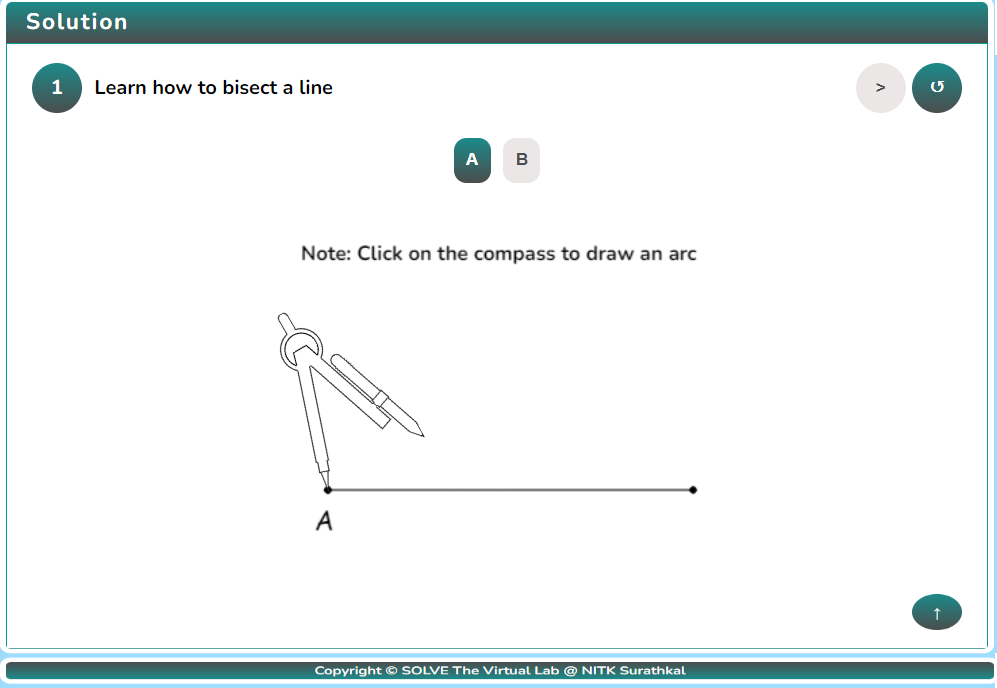
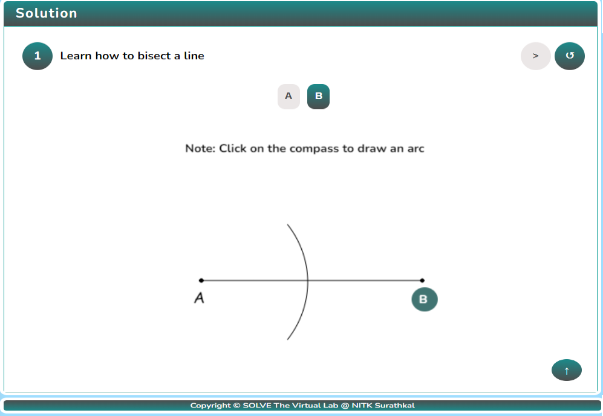
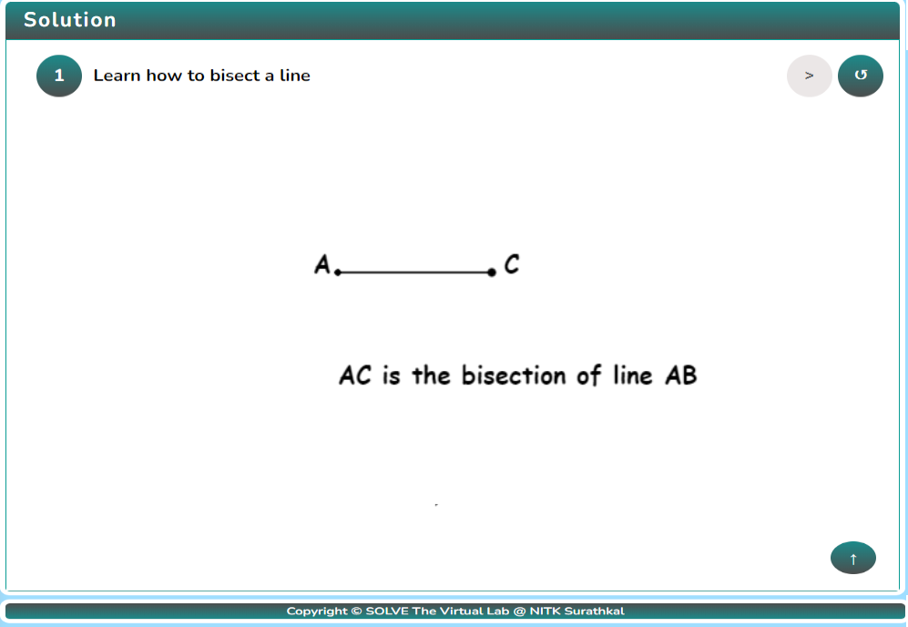

### Procedure

1. Click on the Objective icon  to view the objective of the simulation.

   

2. Click on the Apparatus icon  to check the tools required for this simulation.

   

3. Click on the Solution icon ,select any experiment.

   

4. Choose any experiment to begin the simulator. For this, the “To bisect a line” experiment is selected.

   

5. Click the “A” button to place the compass on point “A”.

   

6. Click on the compass’s pencil to cut an arc on Line AB

   

7. click on B to cut an arc from point B to line AB.

   

8. The intersection of the two arcs is point C, i.e., the midpoint of the line AB. Therefore, the line AC, as shown below, is the bisection of line AB.

   

9. Click on the Next button,to proceed with further simulation steps.

10. To conduct the other two experiments, follow a similar procedure.

11. After performing the experiment, click on the Reset button  to restart the experiment.
