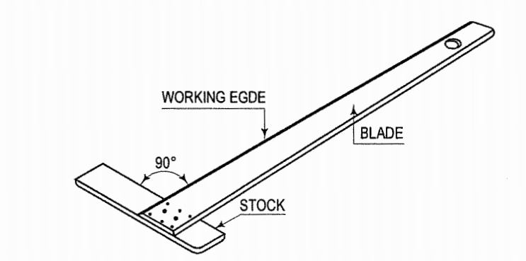
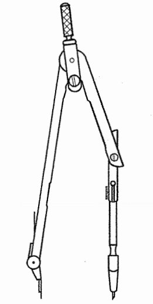
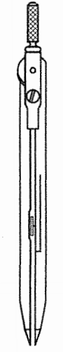
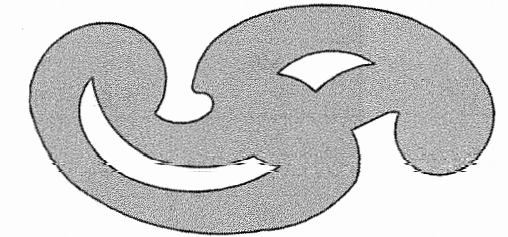
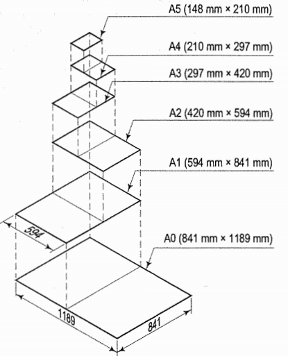
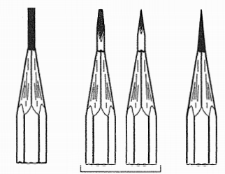
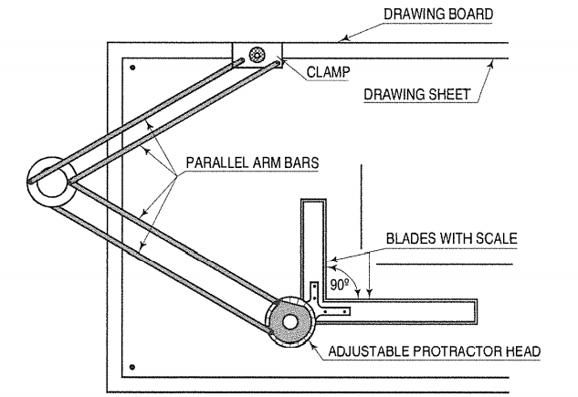
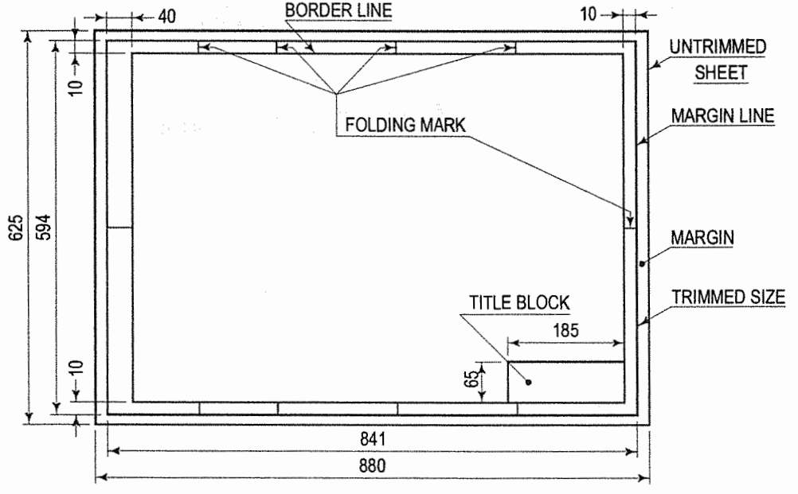
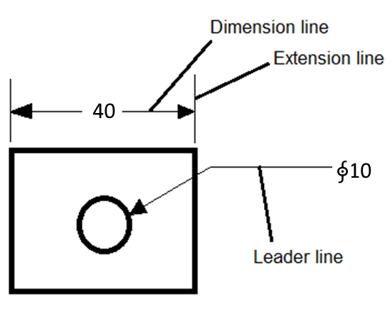

**THEORY**

Engineering Graphics is a technical way of communicating between engineers and designers. It shows physical representation of an object on a sheet of paper (A5, A4, A3, A2, A1 and A0) with detailed dimensions and properties which will lead to a finished product.

The drawing instuments required for a perfect technical drawings are listed below:
1. Drawing Board
 A drawing board is a wooden board where the paper is fixed upon, which is a convinient way to draw. A drawing board is shown in Fig 1. It comes in different sizes such as B0, B1, B2 and B3

Fig 1. Drawing Board

 2. T- square
A T-square as shown in Fig 2, is made up of two pieces of hard quality wood, which is fastened at rigt angles to each other. Horizontal lines are drawn by using the working edge of the drawing board.

Fig 2. T-square

 3. Set squares - 45o and 30o - 60o
A set square as shown in Fig 3, is used to darw vertical lines by taking the horizontal lines drawn by T-square as the reference.

Fig 3. Set-Square

4. Drawing Instrument box containing:
      i. Large-size compass ith interchangable pencils and pens
      Compasses as shown in Fig 4, are used in drawing circles and arcs of circles.

     

     
     
     Fig 4. Large-size compass

     

     
      ii. Lengthening bar
       Circles measuring more than 150mm are drawn using a lengthening bar as shown in Fig 5.

     

    

     Fig 5. Lengthening Bar

     

      iii. Small bow compass
       Circles and arcs measuring less than 25mm radius are drawn using a smll bow compass as shown in Fig 6. 

     

     
     
     
     Fig 6. Small bow compass

     
 

      iv. Large size divider
       Dividers as shown in Fig 7, with needle attachments, are used to divide lines and arcs into equal parts, transfer dimensions and to set off given distances from the scale to the drawing 

     

     
     
     Fig 7. Large Size divider

     

      v. Small bow divider
      A small bow divider is used to make minue divisions

      vi. Small-bow ink pen
     It is used for drawing smal cicles and arcs in ink.
     
      vii. Inking Pen
     An inking pen as shown in Fig 8, is used to draw srtaigh lines and non circular arc in ink

     

     
     

     Fig 8. Inkng Pen

     

 5. Scales
 Scales as shown in Fig 9, helps in taking measurements accurately. 

Fig 9. Scale

 6. Protractor
A protractor as shown in Fig 10, helps n measuring angles accurately.

Fig 10. A Protactor

 7. French Curves
  French curves as shown in Fig 11, are used to draw curves which cannot be drawn using a compass.

Fig 11. Frech Curves

 8. Drawing Papers
  Drawing papers are materials made up of fiberes which is used t odraw and write. These come in many sizes as shown in Fig 12.

Fig 12. Paper and it's diffrent size

 9. Drawing Pencils
  Quality of pencils used to draw makes the sketches more appealing. There are pencils of different hardness which are usually indicated by letters and numbers. HB refers to medium grade, 2H, 3H, 4H indicates incereasing hardness and 2B, 3B, 4B indicates softer grades. The lead may be sharpened in two different forms i.e conical point or chisel edge as shown in Fig 13.

Fig 13. Pencil and it's edges

 10. Sand-Paper block
  A sand paper block as shown in Fig 14, is used to sharpen pencils.

Fig 14. Sand-paper Block

 11. Eraser
  Erasers to used to erase mistakes made in pencil sketching.

 12. Drawing Pins, clips or adhesive tapes
  These are used to fix papers on to the drawing boards.

 13. Duster
  A duster is used to clean instruments before drawing.

 14. Drafting Machines
  A T-Square, Set-Square, scale and protractor is combined in a drafting machine as shown in Fig 15. One of it's end is clamped to the drawing board and the other end is an adjustable head which can be moved aroud on the sheet.

Fig 15. Drafting Machine

 15. Roll-n-draw
A Roll-n-draw as shown in Fig 16, consists of a graduated roller which is used to draw parallel lines.

Fig 16. Roll-n-Draw

Instructions to draw border lines:
1. Mark points along the left-hand edge of the paper at required  distances from the top and  bottom edges and through them, draw horizontal lines with the  T-square or by mini-drafter.

2. Along the upper horizontal line,  mark two points at required distances from the left-hand and 
right-hand edges, and draw vertical lines through them by mini-drafter.

3. Erase the extra lengths of lines beyond the points of intersection.

4. One more horizontal line at about 10 mm to 20 mm from the bottom  border line may also be drawn and the space divided into three blocks. A  title block as shown in Fig 17 must be drawn in left-hand bottom corner  above block-3; in which 
(a) name of the institution, 
(b) title of the drawing, and 
(c) name, class etc. of the student may be written.

Fig 17. Schematic representation of Border-Lines

 

**RULES OF DIMENSIONING**

1.  Between any two extension lines, there must be one and only one dimension
    line bearing one dimension.

2.  As far as possible, all the dimensions should be placed outside the views.
    Inside dimensions are preferred only if they are clearer and more easily
    readable.

3.  All the dimensions on a drawing must be shown using either Aligned System or
    Unidirectional System. In no case should, the two systems be mixed on the
    same drawing.

4.  The same unit of length should be used for all the dimensions on a drawing.
    The unit should not be written after each dimension, but a note mentioning
    the unit should be placed below the drawing.

5.  Dimension lines should not cross each other. Dimension lines should also not
    cross any other lines of the object.

6.  All dimensions must be given.

7.  Each dimension should be given only once. No dimension should be redundant.

8.  Do not use an outline or a centre line as a dimension line. A centre line
    may be extended to serve as an extension line.

9.  Avoid dimensioning hidden lines.

10. For dimensions in series, adopt any one of the following ways.

    1.  Chain dimensioning (Continuous dimensioning) All the dimensions are
        aligned in such a way that an arrowhead of one dimension touches
        tip-to-tip the arrowhead of the adjacent dimension. The overall
        dimension is placed outside the other smaller dimensions.

    2.  Parallel dimensioning (Progressive dimensioning) All the dimensions are
        shown from a common reference line. Obviously, all these dimensions
        share a common extension line. This method is adopted when dimensions
        have to be established from a particular datum surface

    3.  Combined dimensioning. When both the methods, i.e., chain dimensioning
        and parallel dimensioning are used on the same drawing, the method of
        dimensioning is called combined dimensioning.

**Lines**  
Lines is one important aspect of technical drawing. Lines are always used to
construct meaningful drawings. Various types of lines are used to construct
drawing, each line used in some specific sense. Lines are drawn following
standard conventions mentioned in BIS (SP46:2003). A line may be curved,
straight, continuous, segmented. It may be drawn as thin or thick. A few basic
types of lines widely used in drawings are shown in Table 1.

 Table 1. Types of lines and their application 
 

**Geometric Construction**

Drawing consists of construction of primitive geometric forms viz. points, lines
and planes that serve a the building blocks for more complicated geometric
shapes as shown in Fig 18, and defining the position of object in space.

Fig 18. Different types of Geometric Figures

The important elements of dimensioning consists of extension lines, leader line,
arrows and dimensions.

**Extension line** A thin, solid line perpendicular to a dimension line,
indicating which feature is associated with the dimension. There should be a
visible gap of 1.5 mm between the features corners and the end of the extension
line.Fig 19 shows extension lines.  
**Leader line**  
A thin, solid line used to indicate the feature with which a dimension, note, or
symbol is associated. Generally this is a straight line drawn at an angle that
is neither horizontal nor vertical. Leader line is terminated with an arrow
touching the part or detail as shown in Figure 2. On the end opposite the arrow, the leader line will
have a short, horizontal shoulder. Text is extended from this shoulder such that
the text height is centered with the shoulder line

Fig 19. Extension lines

-   Arrows should be 1/3rd as wide as they are long - symbols
    placed at the end of dimension lines to show the limits of the dimension.
    Arrows are uniform in size and style, regardless of the size of the drawing.
    Various types of arrows used for dimensioning is shown in Fig 20.

Fig 20. Types of arrows used for dimensioning 

**Dimensioning of angles:** 
The normal convention for dimensioning of angles are
illustrated in Fig 21.

Figure 21. Representation of Angles   

source: https://nptel.ac.in/courses/112/103/112103019/

