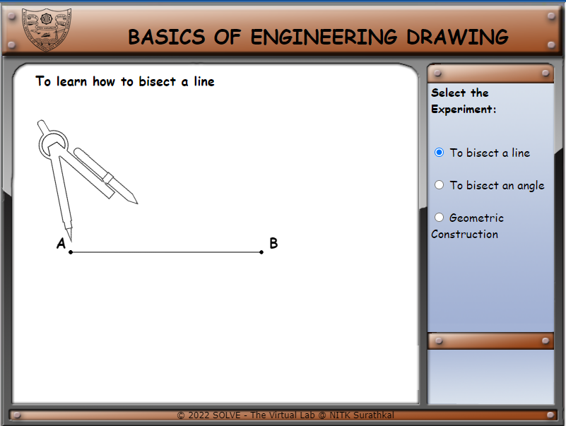
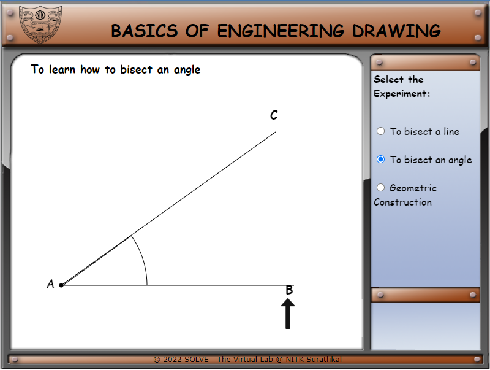

1. **Select the construction** from the panel on the right side(I.e: Angle
    bisector).

2. **Click on** highlighted button for the next step.

3. **Click on the compass** for the next step.

4. Follow the simulator to complete the construction.

5. **On completion** of one, **select the other construction** and follow the
    simulation. And complete all.

6. Similarly, click **Next** to get to next step in simulation
